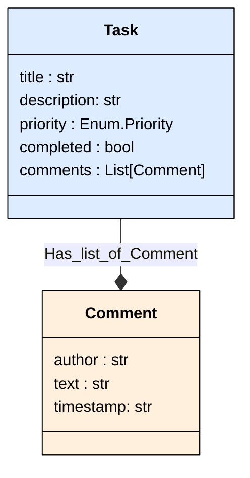

# Pydantic Visualizer

[](https://badge.fury.io/py/pydantic-visualizer)
[](https://www.python.org/downloads/)
[](https://opensource.org/licenses/MIT)

Convert your Pydantic models into beautiful Mermaid class diagrams with ease! 🎨

Pydantic Visualizer automatically generates visual representations of your Pydantic data models, making it easier to understand complex data structures, document your APIs, and communicate your data architecture.

## ✨ Features

- 🔄 **Automatic Conversion**: Transform Pydantic models to Mermaid diagrams instantly
- 🎯 **Relationship Detection**: Automatically identifies and visualizes model relationships
- 📊 **Enum Support**: Special handling and visualization for Enum types
- 🎨 **Customizable Colors**: Configure colors for different element types
- 📝 **Multiple Export Formats**: Save as Markdown or HTML
- 🌐 **Browser Preview**: Open diagrams directly in your browser
- 🔗 **Nested Models**: Handles complex nested model structures
- ⚡ **Type-Safe**: Fully typed with comprehensive type hints

## 📦 Installation

### Using pip

```bash
pip install pydantic-visualizer
```

### Using uv (recommended)

```bash
uv pip install pydantic-visualizer
```

```bash
uv add pydantic-visualizer
```


### For Development

```bash
# Clone the repository
git clone https://github.com/maxime-gillot/pydantic-visualizer.git
cd pydantic-visualizer

# Install with development dependencies using uv
uv pip install -e ".[dev]"
```

## 🚀 Turn this in mermaid diagram

```python
# Define models
class Priority(str, Enum):
    """Task priority levels."""
    LOW = "low"
    MEDIUM = "medium"
    HIGH = "high"
    URGENT = "urgent"


class Comment(BaseModel):
    """Comment on a task."""
    author: str = Field(description="Comment author")
    text: str = Field(description="Comment text")
    timestamp: str = Field(description="When the comment was made")


class Task(BaseModel):
    """Task model with priority and comments."""
    title: str = Field(description="Task title")
    description: str = Field(description="Detailed task description")
    priority: Priority = Field(description="Task priority level")
    completed: bool = Field(default=False, description="Whether task is completed")
    comments: List[Comment] = Field(default_factory=list, description="Task comments")

```
## Task Diagram



## Save it as an html file

See the [Related html file](./examples/output/task_mermaid.html).

--------


> 📚 **More Examples**: Visit the [examples folder](https://github.com/Maxlo24/pydantic-visualizer/blob/main/examples) for 8+ complete, runnable examples covering:
> - Basic usage and nested models
> - Enum handling and custom colors
> - Complex relationships and self-referencing models
> - Saving to Markdown/HTML and browser preview
> - Adding multiple models to one diagram
>
> See the [Examples README](https://github.com/Maxlo24/pydantic-visualizer/blob/main/examples/README.md) for detailed descriptions and usage instructions.

## 🎨 Diagram Features

### Relationship Types

- **Solid arrows** (`-->`) for required relationships
- **Dashed arrows** (`..>`) for optional relationships
- **Star notation** (`*`) for list/collection relationships

### Visual Indicators

- **Different colors** for objects, lists, and enums
- **Dashed borders** for optional nested models
- **Aligned field names** for better readability


### Development Setup

```bash
# Clone the repository
git clone https://github.com/Maxlo24/pydantic-visualizer.git
cd pydantic-visualizer

# Install dependencies with uv
uv pip install -e ".[dev]"

# Run tests
pytest

# Run linting
ruff check .

# Run type checking
mypy pydantic_visualizer
```

## 📝 License

This project is licensed under the MIT License - see the [LICENSE](LICENSE) file for details.

## 🙏 Acknowledgments

- Built with [Pydantic](https://docs.pydantic.dev/) - Data validation using Python type hints
- Diagrams rendered with [Mermaid](https://mermaid.js.org/) - Generation of diagrams from text

## 📮 Contact & Support

- **Repo**: [GitHub Repo](https://github.com/Maxlo24/pydantic-visualizer)
- **Issues**: [GitHub Issues](https://github.com/Maxlo24/pydantic-visualizer/issues)
- **Discussions**: [GitHub Discussions](https://github.com/Maxlo24/pydantic-visualizer/discussions)

## 🗺️ Roadmap

- [ ] Support for Pydantic v1 models
- [ ] CLI tool for quick visualization
- [ ] Integration with FastAPI for automatic API documentation
- [ ] Export to additional formats (PNG, SVG, PDF)

---

Made with ❤️ by [Maxime Gillot](https://github.com/Maxlo24)