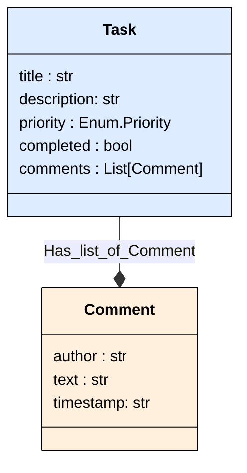

# Task Diagram

--------
# Enums Values

#### Priority
| ENUM     | Value   |
|:---------|:--------|
| `LOW`    | low     |
| `MEDIUM` | medium  |
| `HIGH`   | high    |
| `URGENT` | urgent  |
--------
# Task - Model Descriptions

## Task

Task model with priority and comments.

| Field         | Type          | Description               | Default     |
|:--------------|:--------------|:--------------------------|:------------|
| `title`       | str           | Task title                |             |
| `description` | str           | Detailed task description |             |
| `priority`    | Enum.Priority | Task priority level       |             |
| `completed`   | bool          | Whether task is completed | `False`     |
| `comments`    | List[Comment] | Task comments             | `<factory>` |

## Comment

Comment on a task.

| Field       | Type   | Description               |
|:------------|:-------|:--------------------------|
| `author`    | str    | Comment author            |
| `text`      | str    | Comment text              |
| `timestamp` | str    | When the comment was made |
